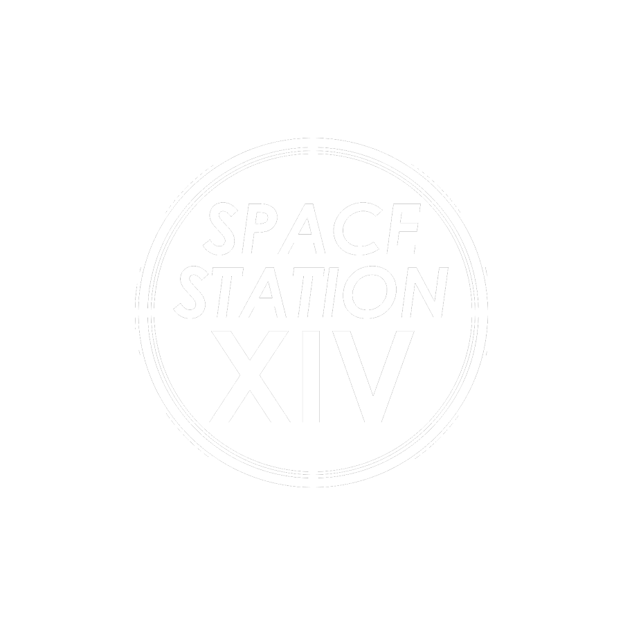

 

 

OnyxBay14 - самостоятельная сборка игры Space Station 14 на движке [Robust Toolbox](https://github.com/space-wizards/RobustToolbox).

## Запуск

1. Склонировать репозиторий.
2. Запустить `RUN_THIS.py` (только один раз).
3. Скомпилировать решение.
